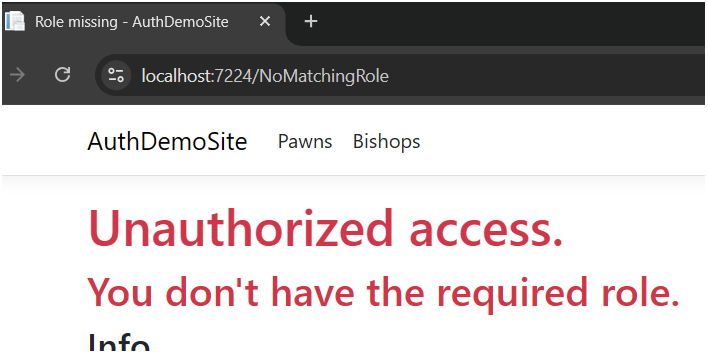

# Step-by-step add authentication and authorization
In this step-by-step tutorial we will add authentication and authorization to a newly created ASP.NET Core Razor Pages web application. 
The users will be authenticated using **Microsoft Entra ID Free**.

1. Create a new ASP.NET Core Razor Pages web application:

    `dotnet new razor -o [projectname]`

2. Add markup and backend code to the Index page, `Index.cshtml` and `Index.cshtml.cs`, to display a logout button and the logged in user claims:
    ```html
    ...

    <form method="post" asp-page-handler="Logout">
        <button type="submit" class="btn btn-danger">Logout</button>
    </form>

    <ul>
        @foreach (var modelClaim in User.Claims)
        {
            <li>@modelClaim</li>
        }
    </ul>
    
    ...
    ```

3. Add AzureAD configuration to the `appsettings.json` (and *user secrets*) and setup the dependencies and request-response pipeline in `Program.cs`, to handle login redirections etc.

    ```json
    {
        ...
        
        "AzureAd": {
            //  "ClientId": "[USER-SECRET]",
            //  "TenantId": "[USER-SECRET]"
            "CallbackPath": "/signin-oidc",
            "Instance": "https://login.microsoftonline.com/",
            "SignedOutCallbackPath": "/signout-oidc"
        }

        ...

    }
    ```

    ```csharp
    ...

    ////////////////////////////////////////
    // Authentication/authorization
    builder.Services
        .AddAuthorization(options =>
        {
            options.AddPolicy("RequirePawnRole", policy =>
                policy.RequireRole("User.Pawn"));

            options.AddPolicy("RequireBishopRole", policy =>
                policy.RequireRole("User.Bishop"));
        })
        .AddAuthentication(options =>
        {
            options.DefaultScheme = CookieAuthenticationDefaults.AuthenticationScheme;
            options.DefaultChallengeScheme = OpenIdConnectDefaults.AuthenticationScheme;
        })
        .AddMicrosoftIdentityWebApp(builder.Configuration, "AzureAd");

    builder.Services.Configure<CookieAuthenticationOptions>(
        CookieAuthenticationDefaults.AuthenticationScheme,
        options =>
        {
            options.AccessDeniedPath = "/NoMatchingRole";
        });
    ////////////////////////////////////////

    ...
    
    ...

    ////////////////////////////////////////
    // Authentication/authorization
    app
        .UseAuthentication()
        .UseAuthorization();
    ////////////////////////////////////////

    ...
    ```

4. Add pages `Pawns` and `Bishops` (chess references). Please and note the required policies in the respective page model. This will cause the user to be redirected to login with a valid Entra ID account.

5. If logged in with a user without the required role(s), the `/NoMatchingRole` is served and the user may navigate to the `Index` page:

    